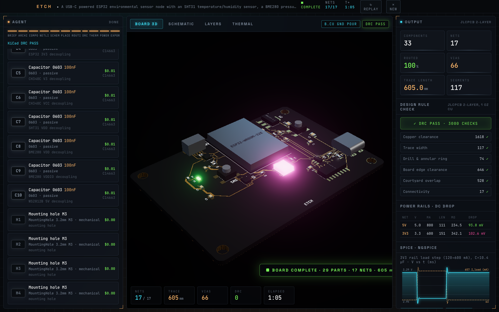
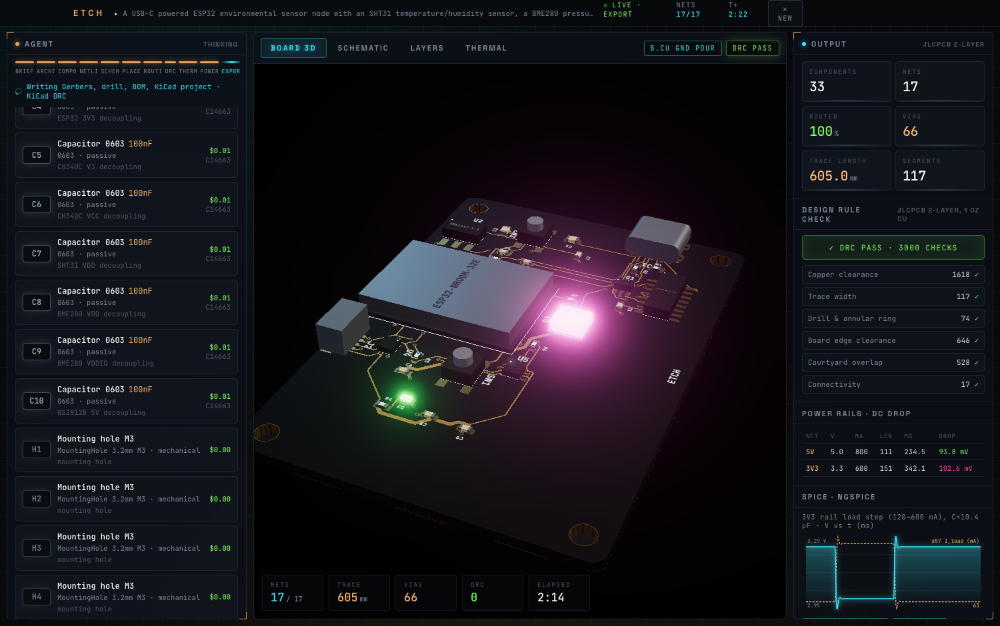
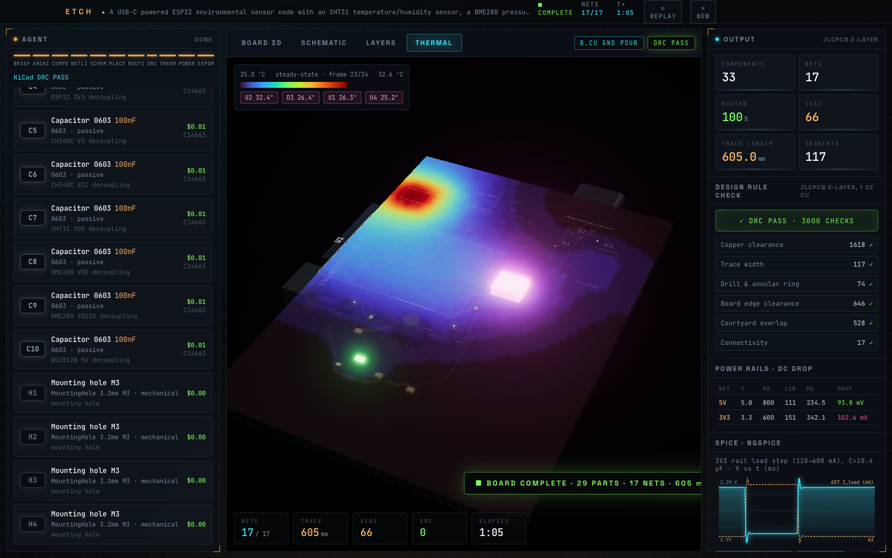
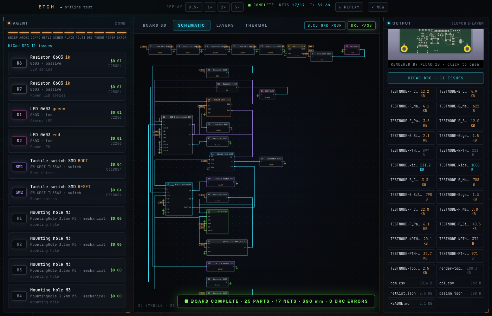
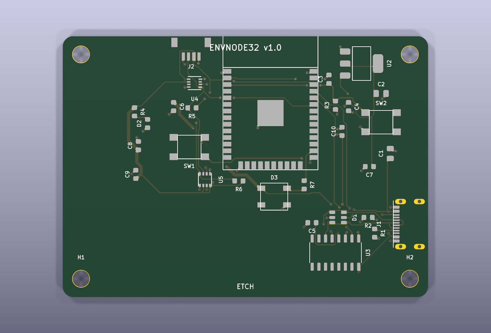

# ETCH — describe a device, get a manufacturable PCB

> An agentic PCB design pipeline with a live 3D front-end. Type what you want to build; an AI hardware architect
> picks the parts, writes the netlist, and a from-scratch EDA engine places, routes, checks, simulates and exports
> a fab-ready 2-layer board — every step streamed and animated in the browser.



```
"A USB-C powered ESP32 environmental sensor node with an SHT31, a BME280,
 a WS2812B status LED, boot/reset buttons and a Qwiic connector."
```
→ 80 seconds later: 33 parts, 17 nets, 605 mm of copper, 66 vias, 0 DRC errors, KiCad DRC PASS,
Gerbers + BOM + pick-and-place + KiCad project in a zip.

## What happens when you press FORGE

| Stage | What runs | What you see |
|---|---|---|
| **Architect** | Claude reads the brief and designs the board from a curated catalog of ~110 real, LCSC-stocked parts (pinouts, footprints, design hints). Output is validated and repaired into a netlist. | Engineering reasoning streams live; component cards fly in. |
| **Schematic** | ELK layered layout in the browser: ports on the right sides, orthogonal wires, power flags & GND bars like a real schematic. | Wires draw themselves; hover highlights a net (also in 3D). |
| **Placement** | Simulated annealing with edge-constrained connectors, antenna keep-outs, courtyard repulsion. Six seeds anneal in parallel and get test-routed; the best wins. | Parts drop onto the board and settle. |
| **Routing** | 2-layer 45° maze router: clearance-aware obstacle dilation, fine-pitch escape stubs, vias, rip-up & reroute, bottom GND pour with island detection and healing. | Every trace draws in with a glowing routing head; airwires vanish as nets complete. |
| **DRC** | Exact-geometry check against JLCPCB 2-layer rules: clearance, width, drill/annular ring, edge clearance, courtyards, connectivity. | Checklist + clickable violation markers on the board. |
| **Thermal / Power / SPICE** | Steady-state heat solve, DC IR-drop per rail from the actual copper, and an **ngspice** transient of the regulated rail under a load step using the board's real decoupling. | Animated heatmap, rail table, oscilloscope-style chart. |
| **Export** | RS-274X Gerbers (X2), Excellon drills, JLCPCB BOM & CPL, a KiCad 9/10 project — then an independent `kicad-cli pcb drc` and a KiCad 3D render of the same board. | Download buttons, "KiCad verified" badge, render thumbnail. |

<p align="center">
 <br>
 
</p>

Everything runs locally and everything is free: the agent runs through the Claude Code CLI on your own subscription
(or `ANTHROPIC_API_KEY` if set), KiCad and ngspice are open source.

## Quick start

Requirements: Python 3.12 via [uv](https://docs.astral.sh/uv/), Node 20+ with pnpm, and the
[Claude Code CLI](https://claude.com/claude-code) logged in (`claude -p "hi"` should answer).
Optional but recommended: [KiCad 9/10](https://kicad.org) (independent DRC + Gerber export + render) and
`ngspice` (`brew install ngspice`).

```bash
git clone https://github.com/spandan-kumar/pcb-fab.git && cd pcb-fab
./run.sh                    # starts backend :8000 and frontend :5173
# or separately:
cd backend  && uv sync && uv run uvicorn etch.main:app --port 8000
cd frontend && pnpm install && pnpm dev
```

Open http://localhost:5173, pick an example chip or type your own brief, press **FORGE IT**.

### Demo-safe modes

- Example prompts marked *cached* replay a stored agent answer instantly; the rest of the pipeline still runs live.
  Pass `{"force_live": true}` in the start options to call the model anyway.
- `?replay=<run_id>` replays any previous run event-for-event (`GET /api/runs` lists them, with speed controls 0.5×–5×).
- `?mock=1` runs the UI on synthetic data when the backend is down.
- Every run is stored in `backend/runs/<id>/` with the full event log, Gerbers, KiCad project, README and render.

### Environment

| Variable | Default | Meaning |
|---|---|---|
| `ETCH_CLAUDE_MODEL` | `claude-fable-5-1` | Model for the Claude CLI backend (Opus 5's safety classifier false-positives on the catalog prompt; Sonnet is used as fallback). |
| `ETCH_LLM` | auto | `cache` forces cached agent output only. |
| `ANTHROPIC_API_KEY` | — | If set, the Anthropic SDK is used instead of the CLI. |
| `ETCH_PROMPT_VERSION` | `1` | Bump to invalidate the demo cache. |

## Results on the bundled examples

| Example | Parts | Routed | ETCH DRC | KiCad 10 DRC |
|---|---|---|---|---|
| ESP32 environmental node | 33 | 100 % | 0 errors | PASS |
| LiPo ESP32-C3 beacon | 30 | 100 % | 0 errors | PASS |
| ESP32-S3 data logger | 32 | 100 % | 0 errors | PASS |
| RS-485 industrial node | 31 | 100 % | 0 errors | PASS |
| Dual-motor robot driver | 42 | 94 % | 2 nets unrouted | 1 unconnected |
| Arduino-style AVR board | 34 | 91 % | 3 nets unrouted | 1 unconnected |

The two incomplete boards choke on the same spot: the 0.5 mm-pitch USB-C with interleaved D+/D- pins, plus (on the AVR
board) a TQFP-32 and 18 header pins. The router works on a 0.2 mm grid, so that connector offers about one legal lane
per pin and rip-up cascades instead of converging. Failures are shown honestly (red airwires, listed in DRC); the exported
KiCad project lets you finish those nets by hand in minutes. See [Limitations](#limitations).

## How it works

```
frontend (React + three.js)  ⇄  WebSocket /ws/design  ⇄  backend (FastAPI)
                                                              │
   brief → architect (Claude) → components → netlist → placement trials (multiprocess)
         → placement replay → router → DRC → thermal → power/spice → export (Gerber, KiCad, BOM, zip)
```

The whole system is event-driven: the backend emits a typed event stream (see [`PROTOCOL.md`](PROTOCOL.md)), the
frontend is a pure reducer over those events, so live runs, replays and mocks share one code path.

```
PROTOCOL.md          event contract
backend/etch/
  catalog.py         parts: pinouts, footprints, LCSC ids, design hints (fed to the agent as its parts list)
  footprints.py      parametric footprint generators (0402…1206, SOT, SOIC/TSSOP/QFP/QFN, modules, connectors, THT)
  agent.py llm.py    system prompt, streaming (Claude CLI / SDK / cache), JSON validation & repair → Board
  placement.py       simulated annealing, edge constraints, ratsnest
  router.py          grid maze router (A*, 8-dir, vias), escape stubs, rip-up/reroute, pour islands
  drc.py             exact-geometry design rule check (JLCPCB 2-layer)
  analysis.py        thermal solve, IR drop, ngspice rail transient
  gerber.py          RS-274X + Excellon writer (incl. negative-plane GND pour), stroke-font silkscreen
  kicad_export.py    .kicad_pcb / .kicad_pro writer, kicad-cli DRC / gerbers / render
  exporter.py        BOM, CPL, netlist, README, zip packaging
  pipeline.py        orchestration + event emission;  main.py: FastAPI/WebSocket
backend/tests/       run_offline.py (no-LLM full pipeline), replay_run.py, render.py, build_cache.py
frontend/src/        store.ts (reducer), three/ (board scene, effects), schematic/ (ELK), components/
```

### Design rules used

Trace 0.2–0.6 mm by net class, routing clearance 0.18 mm, vias 0.6/0.3 mm, copper-to-edge 0.5 mm, 1.6 mm FR-4,
1 oz copper. Checked against JLCPCB minimums (0.127 mm trace/clearance, 0.3 mm drill, 0.13 mm annular ring).

## Limitations

- **Fine pitch.** 0.5 mm-pitch parts (LQFP-48, QFN, 16-pin USB-C) route unreliably on the 0.2 mm grid. The agent prompt
  steers toward ESP32-class modules and ≥ 0.65 mm pitch packages unless you ask for a specific chip.
- **Single-level rip-up.** Rerouted nets can't rip up others, so dense boards may leave a net or two unrouted.
- **Footprints are parametric approximations** of the real packages — good enough for DRC-clean boards, but check the
  connector footprints against the manufacturer drawings before ordering.
- **No schematic file.** The schematic is a browser view; the netlist is exported as JSON and inside the `.kicad_pcb`.
- The thermal and SPICE models are deliberately simple first-order models meant to catch gross problems, not sign-off tools.

## Contributing

See [CONTRIBUTING.md](CONTRIBUTING.md). Most-wanted: more catalog parts, a staggered fine-pitch escape pattern in the
router, cap-to-IC adjacency in placement, and a Gerber viewer built from the exported files.

## License

MIT — see [LICENSE](LICENSE). Built with Claude Code during a hackathon; the EDA core (placer, router, DRC, Gerber and
KiCad writers) is original code with no external EDA dependencies.
